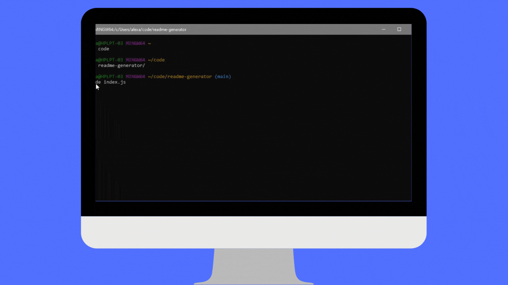

# Unit 09 Node.js: Good README.md Generator 

## Description

This project is a README.md generator utilizing node.js prompted in the command line to help developers save time in creating README files and focus on their coding.

When prompted the quiz should meet the following criteria:

* The user will be prompted for information about their application repository
* THEN a high-quality, professional README.md is generated with the information provided for the following: the title of the project, sections entitled Description, Table of Contents, Installation, Usage, License, Contribution, Tests, and Questions
* When a user chooses a license from a list of options then a badge is added near the top of the README and a notice is added to the section of the README entitled License that explains which license the application is covered under
8 When a user enters their GitHub username and email address it will be included in the Questions section with direct links
8 When a user clicks on the links of the Table of Contents they will be taken to the corresponding section

## Screen Example of Application

Check out the [`exampleREADME.md`](https://github.com/almurawski15/readme-generator/blob/main/exampleREADME.md)

## Table of Contents

- [Installation](#Installation)
- [Usage](#Usage)
- [License](#License)
- [Contributors](#Contribution)
- [Tests](#Tests)
- [Questions](#Questions)

## Installation

Steps required to install project and how to get the development environment running:

To generate your own README, first run npm install in order to install the following npm package dependencies as specified in the package.json:

* [`inquirer`](https://www.npmjs.com/package/inquirer) that will prompt you for your inputs from the command line

## Usage 

This is a command-line application that will be invoked by the following command:

run node.js 

## License

This project has been licensed through a MIT License.

## Questions

You can find the following repository at https://github.com/almurawski15/readme-generator. If you have any questions, please reach out to me via email at almurawski15@gmail.com.